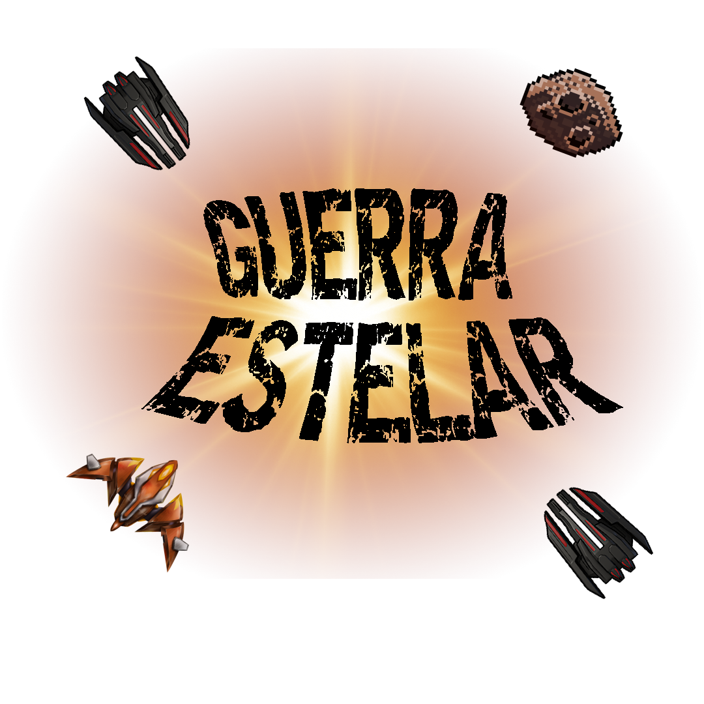
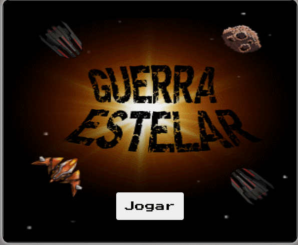

<h1 align='right'></h1>

<h2 align='center'></h2>

<h1 align='center'>----Em desenvolvimento----</h1>

<h2 align='center'><a href='https://jonnathaxd.github.io/Guerra_Estelar/'>TESTE AQUI A APLICAÇÃO</a></h2>

# 📋 Sobre

Guerra estelar foi uma aplicação pessoal feita para testar os conhecimentos de javascript, contando com uma parte de recorde em localstorage e algumas peculiaridades :)

---

# 🚀 Tecnologias utilizadas

- HTML
- CSS
- JavaScript

Made with ❤ by Geova Jonnatha 🐱‍👤 See my <a href='https://www.linkedin.com/in/geova-jonnatha-b7ba08188/'>linkedin</a>
